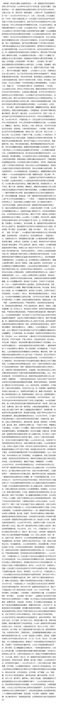

# paddlenlp测试

使用gpu测试下速度

## 电脑配置：

| 类型  | 配置                                                   |
|-----|------------------------------------------------------|
| CPU | Intel(R) Core(TM) i7-9700KF CPU @ 3.60GHz   3.60 GHz |
| RAM | 16.0 GB                                              |
| 显卡  | GeForce RTX 2060                                     |

## 测试文字： 7492个字
<div align="center">
    
</div>

## 执行结果

| 项目             | 结果        | 备注 |
|----------------|-----------|--|
| jionlp         | 470~530ms | 情感和省市 |
| paddlenlp(gpu) | 450~540ms | 不分析省市 |
| paddlenlp(gpu) | 1.30~1.37s | 情感和省市 |

## 结论
gpu版本相较cpu版本速度提升不多，cpu版本500多文字大概花费在1~2s左右。
所以后续硬件升级后，可以考虑使用飞桨做情感分析+jionlp做省市提取


## windows 安装 CUDA/cuDNN

[详见](https://zhuanlan.zhihu.com/p/99880204)

## Poetry

windows安装：

```shell
(Invoke-WebRequest -Uri https://install.python-poetry.org -UseBasicParsing).Content | py -
```

参考：[安装](https://python-poetry.org/docs/#installing-with-the-official-installer)

验证

```shell
poetry --version
```

### 更新Poetry版本

更新到最新版本

```shell
poetry self update
```

更新到预发布版本

```shell
poetry self update --preview
```

更新到指定版本

```shell
poetry self update 0.8.0
```

> 注意： self update命令仅在推荐安装程序安装Poetry时有效。

### 常用命令汇总

![常用命令汇总][1]

### 项目初始化

```shell
poetry new demo-project
```

新建项目的目录结构如下：

```shell
tree demo-project 

demo-project
├── README.rst
├── poetry.lock
├── pyproject.toml
├── demo_project
│   └── __init__.py
└── tests
    ├── __init__.py
    └── test_demo_project.py

3 directories, 6 files
```

同时，项目下会自动生成pyproject.toml文件，该文件的主要用途是依赖管理、构建、打包、发布，内容如下：

```shell
[tool.poetry]
name = "demo-project"
version = "0.1.0"
description = ""
authors = [""]

[tool.poetry.dependencies]
python = "^3.9"

[tool.poetry.dev-dependencies]
pytest = "^5.2"

[build-system]
requires = ["poetry-core>=1.0.0"]
build-backend = "poetry.core.masonry.api"
```

配置说明：

[tool.poetry.dependencies] ：在这里您可以列出项目需要的所有依赖包。 就像旧 requirements.txt 文件一样。 您可以手动完成此操作，然后调用命令
poetry install 以将其全部安装以用于软件包开发和工作目的。 如果您使用

```shell
poetry add <dependency_name>安装依赖包 相当于使用 pip install <dependency_name>
```

[tool.poetry.dev-dependencies] ：配置仅用于开发的依赖包。
> 备注：如果你想使用 src 文件夹，可以添加 --src 选项，这会把程序包嵌套在 src 文件夹里。

### 已有项目初始化

```shell
poetry init
```

根据它的提示输入你的项目信息，不确定的内容就按下 Enter 使用默认值，后续也可以手动更新。

## 虚拟环境管理

### 创建虚拟环境

```shell
poetry install
```

### 激活虚拟环境

```shell
poetry shell
```

### 查看虚拟环境信息

```shell
poetry env info
```

### 显示虚拟环境所有列表

```shell
poetry env list
```

### 删除虚拟环境

- 可以直接删除虚拟环境文件夹
- 通过poetry env remove命令删除

```shell
# 执行删除虚拟环境时，需要指定对应的解析器版本
poetry env remove python3
```

[1]: img/1.jpg